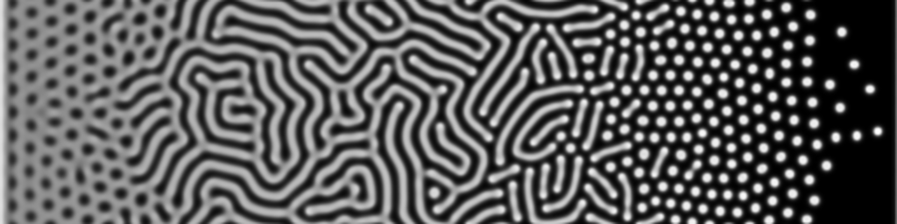
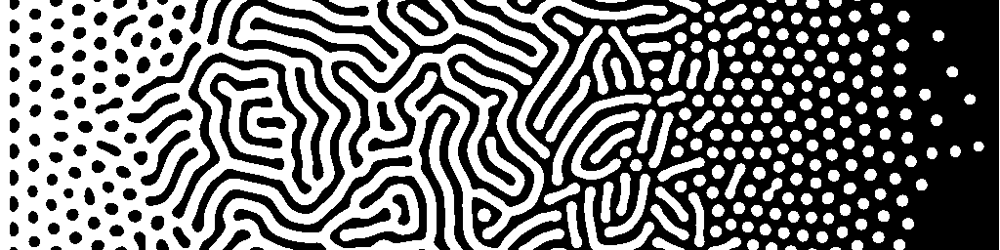

# Grey-Scott Turing Pattern Generator

This project generates customizable Turing patterns using the Gray-Scott reaction-diffusion model. It was created as part of a personal exploration into the themes of emergence and imperfection, culminating in a tattoo design that blends order and chaos through mathematically generated textures.

### Grayscale output of this script 

### After thresholding in GIMP

## Getting Started
- Clone the repo: `git clone git@github.com:tbrownhe/turing-pattern.git`
- Install dependencies: `conda install -f dev_environment.yml`
- Activate the environment: `conda activate turing`
- Run the script: `python src/turing.py`
- Images are saved as `images/turing_pattern_{timestamp}.png`

Each PNG embeds the parameter dictionary used to generate it in its metadata (TuringParams field), so you can easily figure out how to regenerate it. Open the file in Notepad++ or similar to see the metadata at the top.

## Theory and Background
The Gray-Scott model simulates how two chemical components, U and V, react and diffuse through space over time. This reaction-diffusion system leads to a rich variety of self-organized structures like spots, stripes, and mazes.

The core equations are:

- `∂U/∂t = Dₜ * ∇²U - UV² + F(1 - U)`
- `∂V/∂t = Dᵥ * ∇²V + UV² - (F + k)V`

Where:

`Du`, `Dv`: Diffusion rates for components U and V

`F`: Feed rate of U

`k`: Kill rate (removal) of V

`UV²`: Reaction term producing more V

Patterns emerge when the system is destabilized by diffusion, specifically when the inhibitor (V) diffuses faster than the activator (U).

## Image Generation Parameters

All generation parameters are defined in `turing_parameters.json` and support interpolation across either axis. Each parameter can vary smoothly across the image by providing control points and corresponding values.

| Parameter   | Description                                   | Default Axis | Example             |
|-------------|-----------------------------------------------|---------------|----------------------|
| `w`, `h`    | Width and height of the image grid (pixels)   | –             | 512x128              |
| `Du`        | Diffusion rate of U                           | `y`           | `[0.7, 0.7]`         |
| `Dv`        | Diffusion rate of V                           | `y`           | `[0.25, 0.25]`       |
| `F`         | Feed rate (adds U)                            | `x`           | `[0.04, 0.08]`       |
| `k`         | Kill rate (removes V)                         | `x`           | `[0.056, ..., 0.074]`|
| `steps`     | Number of simulation iterations               | –             | 10,000+              |
| `upsample`  | Output scale factor (uses bicubic zoom)       | –             | 2                    |

The Du, Dv, F, and k parameters include:
- `*_ctrl`: Control point positions (fractions from 0.0 to 1.0)
- `*_vals`: Parameter values at those control points
- `*_axis`: Axis along which the parameter varies (x or y)

## Output

The returned image is an 8-bit grayscale PNG.
Metadata is embedded in the file (TuringParams) as a JSON string.
Upsampling improves aesthetics for print or illustration.

## License

This project is licensed under the MIT License.

## Author

Created by @tbrownhe as a tribute to complexity, self-organization, and the mathematical beauty underlying chaos.